# COMPLETE APPLICATION FLOW DIAGRAM

## Single Comprehensive Flow Diagram for Real-Time Chat Application

```plantuml
@startuml
title Real-Time Chat Application - Complete Flow Diagram

actor User as U1
participant "React Frontend" as Frontend
participant "Express Backend" as Backend
participant "MongoDB" as DB
participant "Cloudinary" as Cloud
participant "Socket.IO Server" as Socket
participant "React Frontend B" as FrontendB
actor "User B" as U2

== User Registration & Authentication ==
U1 -> Frontend : 1. Open application
Frontend -> Frontend : 2. Check auth status
alt Not Authenticated
    U1 -> Frontend : 3. Navigate to Signup
    U1 -> Frontend : 4. Enter email, name, password
    Frontend -> Backend : 5. POST /api/auth/signup
    Backend -> Backend : 6. Validate input
    Backend -> Backend : 7. Hash password (bcrypt)
    Backend -> DB : 8. Create user document
    DB -> Backend : 9. User created
    Backend -> Backend : 10. Generate JWT token
    Backend -> Frontend : 11. Set HTTP-only cookie\n& return user data
    Frontend -> Frontend : 12. Save auth state (Zustand)
end

== Login & Connection ==
Frontend -> Backend : 13. GET /api/auth/check
Backend -> Backend : 14. Verify JWT token
Backend -> Frontend : 15. Return authenticated user
Frontend -> Socket : 16. Establish WebSocket connection
Socket -> Socket : 17. Map userId to socketId
Socket -> Frontend : 18. Broadcast online users list
Frontend -> Frontend : 19. Update online status UI

== Load Chat Interface ==
Frontend -> Backend : 20. GET /api/messages/users
Backend -> DB : 21. Query all users
DB -> Backend : 22. Return user list
Backend -> Frontend : 23. Send users data
Frontend -> Frontend : 24. Display users in sidebar

== Start Conversation ==
U1 -> Frontend : 25. Select User B from list
Frontend -> Backend : 26. GET /api/messages/:userBId
Backend -> DB : 27. Query messages between users
DB -> Backend : 28. Return message history
Backend -> Frontend : 29. Send conversation data
Frontend -> Frontend : 30. Display messages in chat
Frontend -> Frontend : 31. Clear unread badge for User B

== Send Text Message ==
U1 -> Frontend : 32. Type message & click send
Frontend -> Backend : 33. POST /api/messages/send/:userBId\n{text: "Hello"}
Backend -> Backend : 34. Verify authentication
Backend -> DB : 35. Create message document
DB -> Backend : 36. Message saved
Backend -> Socket : 37. Get User B's socket ID
Socket -> FrontendB : 38. Emit 'newMessage' event
FrontendB -> FrontendB : 39. Update chat UI instantly
FrontendB -> FrontendB : 40. Show toast notification
FrontendB -> FrontendB : 41. Play notification sound
FrontendB -> FrontendB : 42. Increment unread badge
FrontendB -> FrontendB : 43. Show browser notification
Backend -> Frontend : 44. Return success response
Frontend -> Frontend : 45. Display sent message

== Send Image Message ==
U1 -> Frontend : 46. Select image file
Frontend -> Frontend : 47. Convert image to base64
U1 -> Frontend : 48. Click send
Frontend -> Backend : 49. POST /api/messages/send/:userBId\n{image: base64}
Backend -> Cloud : 50. Upload image
Cloud -> Backend : 51. Return image URL
Backend -> DB : 52. Create message with image URL
DB -> Backend : 53. Message saved
Backend -> Socket : 54. Emit message to User B
Socket -> FrontendB : 55. Deliver image message
FrontendB -> FrontendB : 56. Display image inline
Backend -> Frontend : 57. Return success
Frontend -> Frontend : 58. Show sent image

== Update Profile ==
U1 -> Frontend : 59. Navigate to Profile page
U1 -> Frontend : 60. Upload new profile picture
Frontend -> Backend : 61. PUT /api/auth/update-profile\n{profilePic: base64}
Backend -> Cloud : 62. Upload to Cloudinary
Cloud -> Backend : 63. Return CDN URL
Backend -> DB : 64. Update user document
DB -> Backend : 65. User updated
Backend -> Frontend : 66. Return updated user
Frontend -> Frontend : 67. Update UI & Zustand store
Frontend -> Socket : 68. Broadcast profile update
Socket -> FrontendB : 69. Update User A's profile in list

== Real-Time Status Updates ==
U2 -> FrontendB : 70. User B comes online
FrontendB -> Socket : 71. Connect to Socket.IO
Socket -> Socket : 72. Add User B to online users
Socket -> Frontend : 73. Broadcast online users list
Frontend -> Frontend : 74. Show User B as online (green dot)

U1 -> Frontend : 75. User A closes browser
Frontend -> Socket : 76. Disconnect WebSocket
Socket -> Socket : 77. Remove User A from online users
Socket -> FrontendB : 78. Broadcast updated online list
FrontendB -> FrontendB : 79. Show User A as offline

== Logout ==
U1 -> Frontend : 80. Click logout button
Frontend -> Backend : 81. POST /api/auth/logout
Backend -> Backend : 82. Clear JWT cookie
Backend -> Frontend : 83. Logout successful
Frontend -> Socket : 84. Disconnect WebSocket
Frontend -> Frontend : 85. Clear auth state
Frontend -> Frontend : 86. Redirect to login page

@enduml
```

## How This Application Works (Step-by-Step):

**Phase 1: Authentication (Steps 1-12)**
- User opens app, registers with email/password
- Backend hashes password and stores in MongoDB
- JWT token generated and stored in HTTP-only cookie

**Phase 2: Connection Setup (Steps 13-19)**
- Frontend verifies authentication on load
- WebSocket connection established via Socket.IO
- Server maps user ID to socket ID for message routing
- Online users list broadcasted to all clients

**Phase 3: Chat Interface (Steps 20-31)**
- User list loaded from database
- User selects contact to start conversation
- Message history retrieved and displayed
- Unread badges cleared when opening chat

**Phase 4: Real-Time Messaging (Steps 32-45)**
- User types and sends message
- Message saved to MongoDB
- Socket.IO instantly delivers to receiver
- Receiver gets notifications (toast, sound, browser, badge)

**Phase 5: Media Sharing (Steps 46-58)**
- User uploads image file
- Image converted to base64 and sent to backend
- Cloudinary stores image and returns URL
- Message with image URL saved and delivered in real-time

**Phase 6: Profile Management (Steps 59-69)**
- User updates profile picture
- Image uploaded to Cloudinary
- Database updated with new image URL
- Changes broadcast to all online users

**Phase 7: Presence Tracking (Steps 70-79)**
- Socket.IO tracks user connections/disconnections
- Online status updated in real-time
- Green dots show who's available
- Status changes broadcast to all clients

**Phase 8: Logout (Steps 80-86)**
- User clicks logout
- JWT cookie cleared
- WebSocket disconnected
- Redirected to login page

---

## To Create the Diagram:
1. Copy the PlantUML code above
2. Go to: http://www.plantuml.com/plantuml/uml/
3. Paste and generate PNG/SVG
4. Insert into your Word document

---

**END OF FLOW DIAGRAM**
