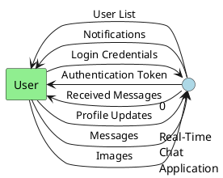
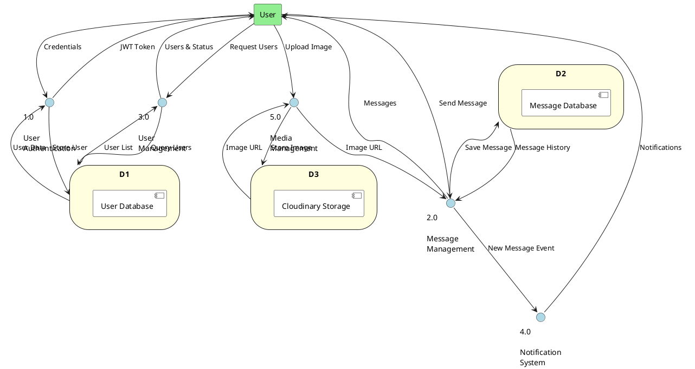
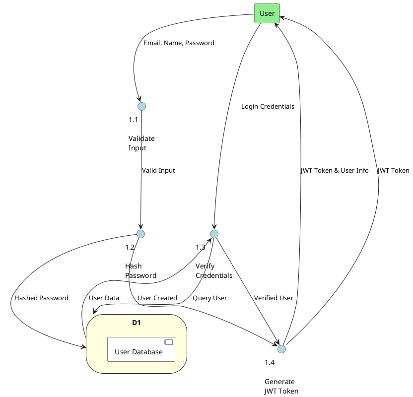
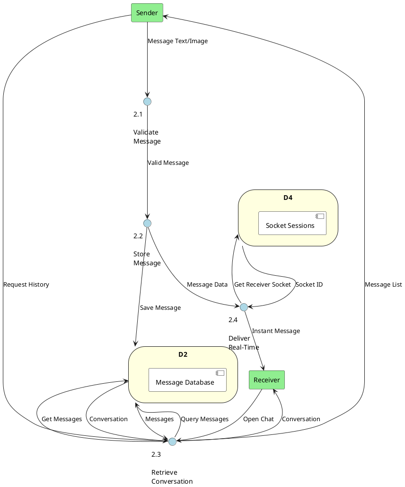
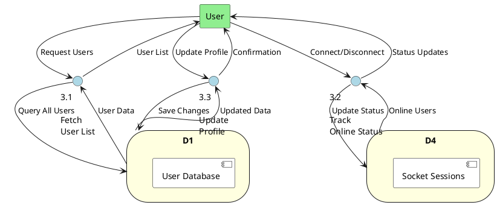
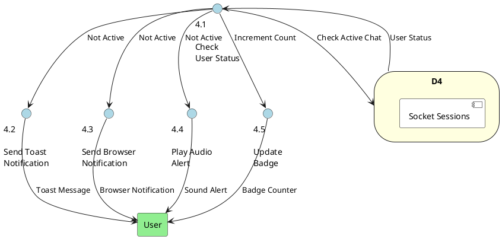
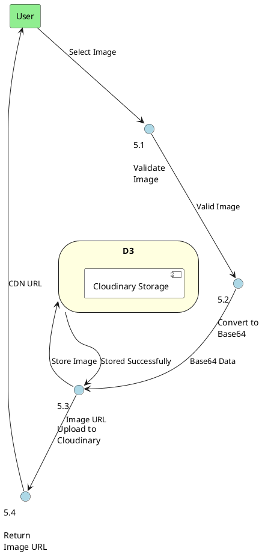
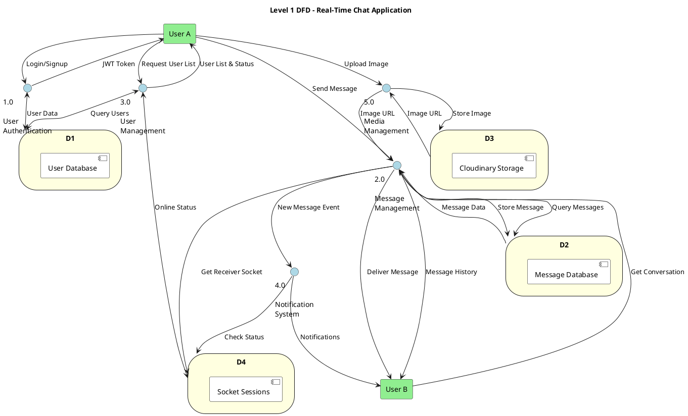

# DATA FLOW DIAGRAMS - PLANTUML CODE
## Real-Time Chat Application (Proper DFD Notation)

---

## Level 0 DFD (Context Diagram)

---

## Level 1 DFD (Major Processes)

---

## Level 2 DFD - Authentication Process (1.0)

---

## Level 2 DFD - Message Management (2.0)

---

## Level 2 DFD - User Management (3.0)

---

## Level 2 DFD - Notification System (4.0)

---

## Level 2 DFD - Media Management (5.0)

---

## Complete Level 1 DFD (All Processes with Data Stores)

---

## How to Use:

1. **Copy any PlantUML code block** from above
2. **Paste into PlantUML editor**: http://www.plantuml.com/plantuml/uml/
3. **Generate the diagram** as PNG or SVG
4. **Add to your PDF/Document**

## DFD Levels Explained:

- **Level 0 (Context)**: Shows the system as a single process with external entities
- **Level 1**: Breaks down into major processes (Authentication, Messaging, User Management, etc.)
- **Level 2**: Details each major process into sub-processes
- **Complete DFD**: Shows all processes and data flows in one comprehensive diagram

---

**END OF DATA FLOW DIAGRAMS**
