# PLANTUML DIAGRAMS FOR REAL-TIME CHAT APPLICATION

## 1. System Architecture Diagram

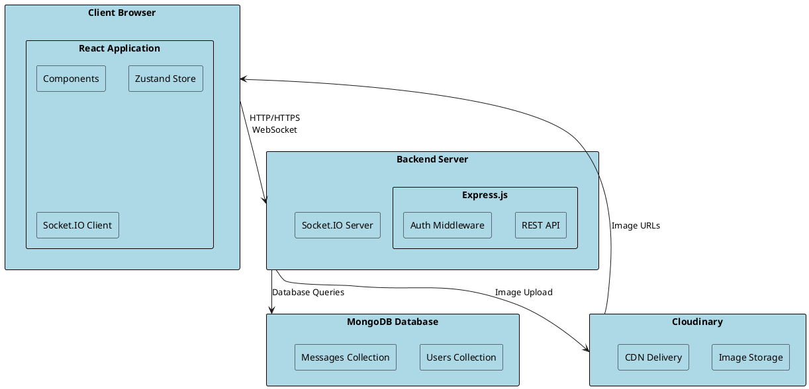

## 2. User Authentication Flow

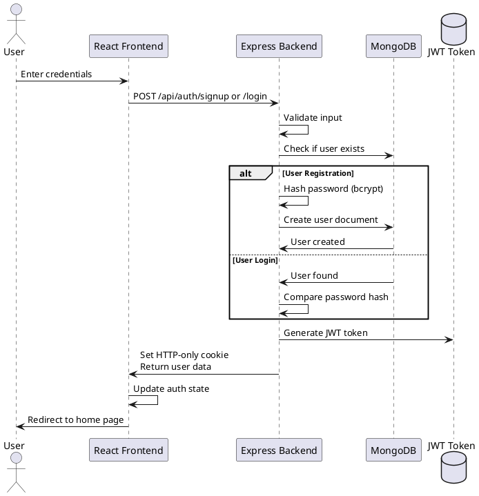

## 3. Real-Time Messaging Flow

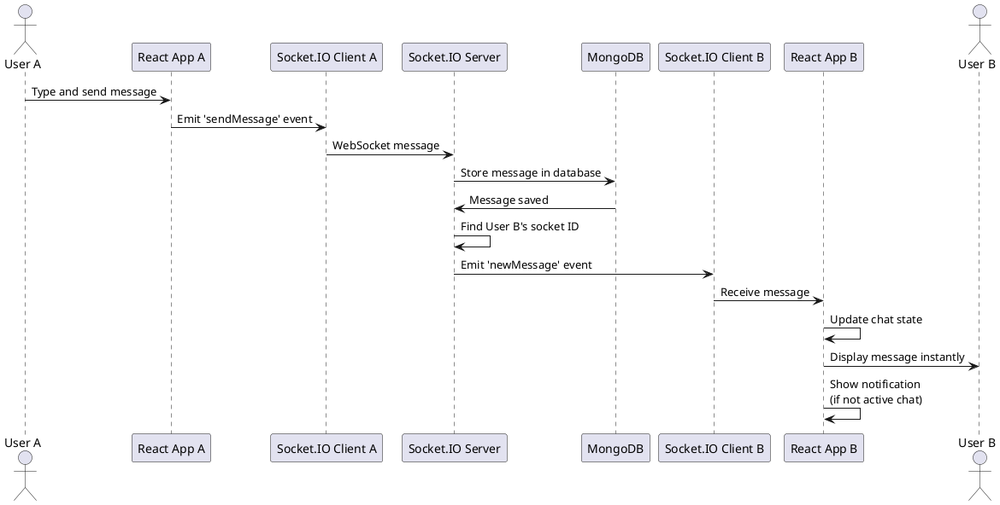

## 4. User Registration Use Case

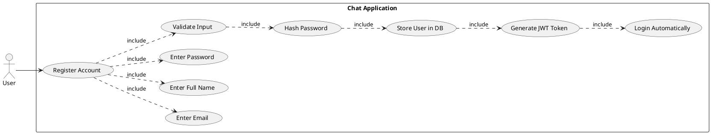

## 5. Messaging Use Case Diagram

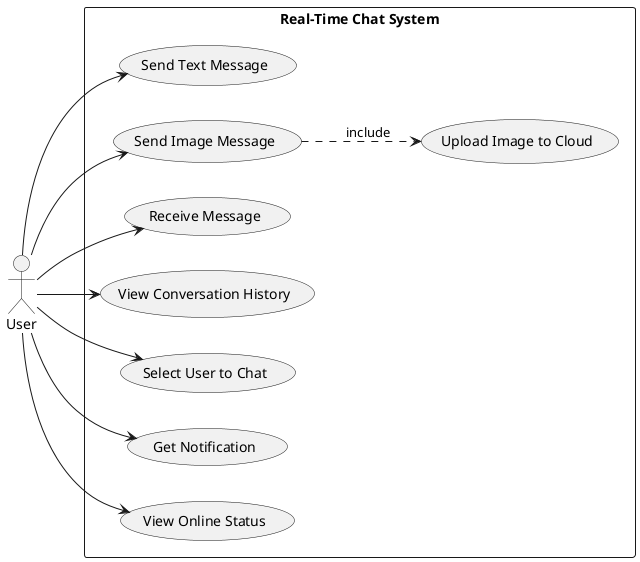

## 6. Database Entity Relationship Diagram

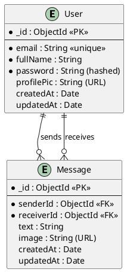

## 7. Component Hierarchy Diagram

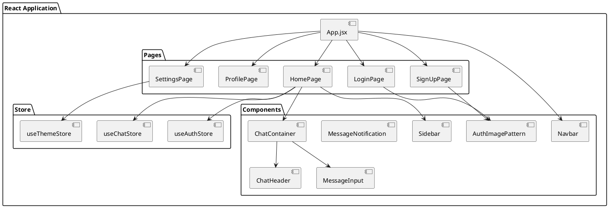

## 8. Sequence Diagram - Send Message with Image

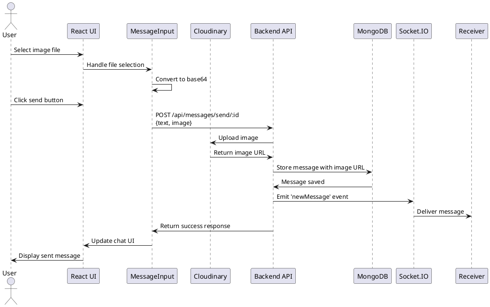

## 9. Activity Diagram - User Login Process

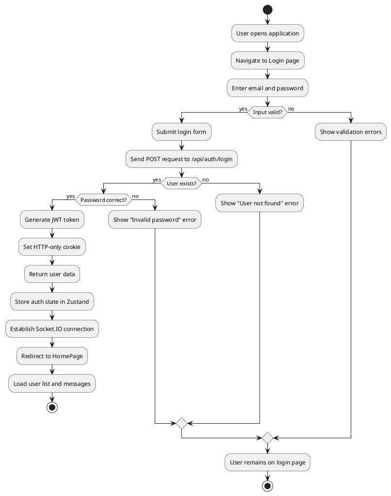

## 10. State Diagram - Message Status

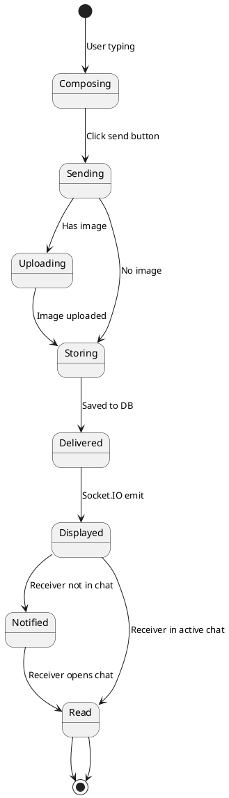

## 11. Deployment Diagram

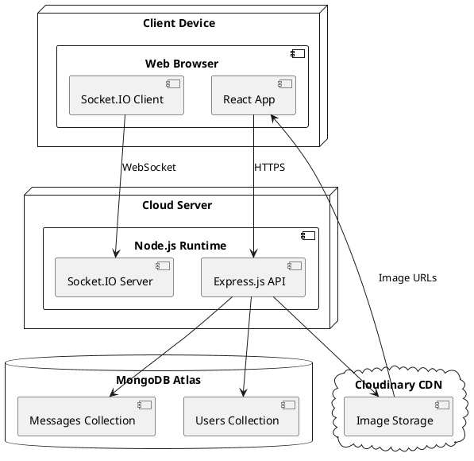

## 12. Class Diagram - Backend Models

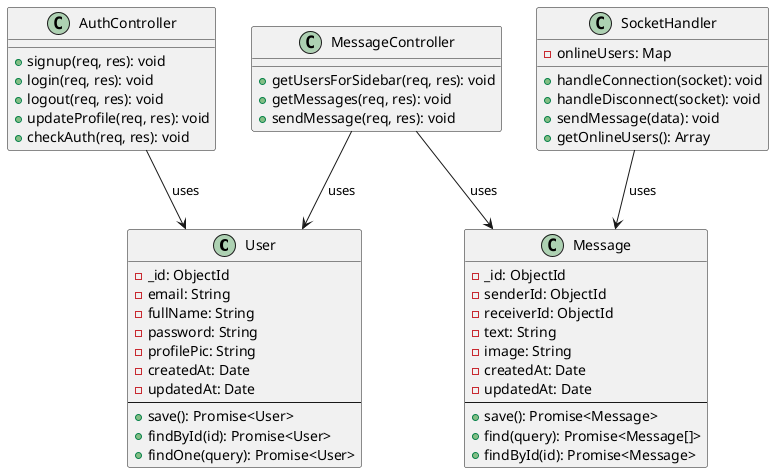

## 13. Activity Diagram - Real-Time Notification Flow

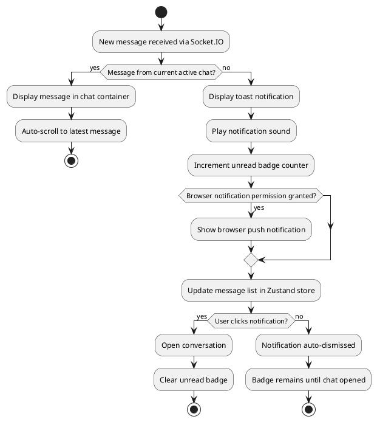

---

## How to Use These Diagrams:

1. **Copy the PlantUML code** from each section
2. **Paste into PlantUML online editor**: http://www.plantuml.com/plantuml/uml/
3. **Or use VS Code extension**: "PlantUML" by jebbs
4. **Export as PNG/SVG** for your documentation

Each diagram visualizes different aspects of your Real-Time Chat Application and can be included in your project report!

---

**END OF PLANTUML DIAGRAMS**
